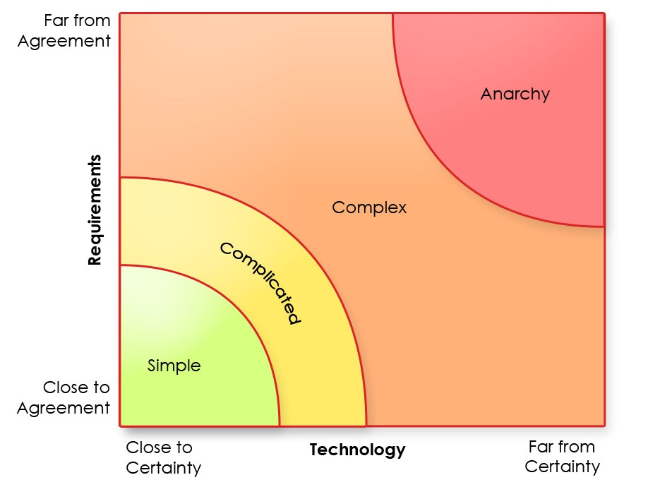
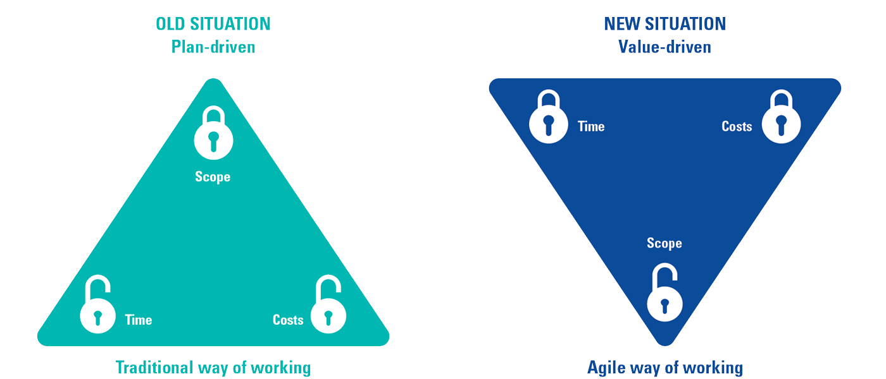
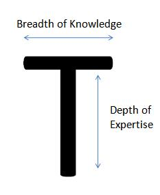
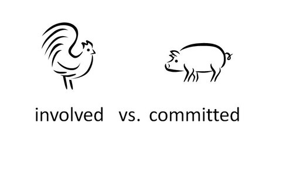
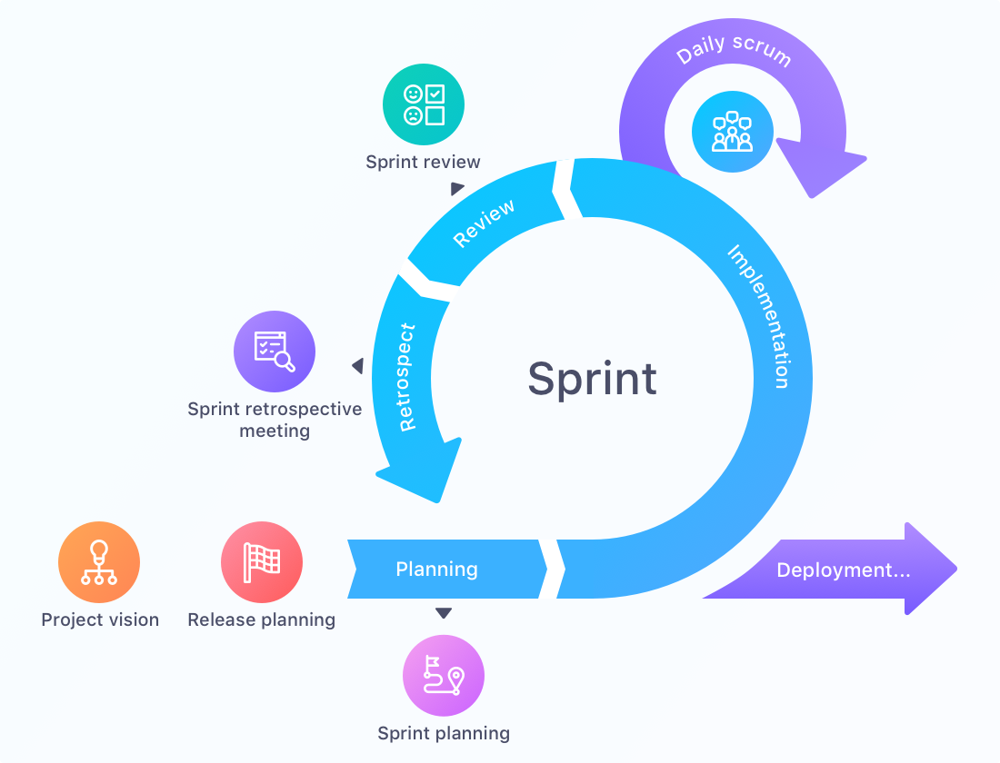
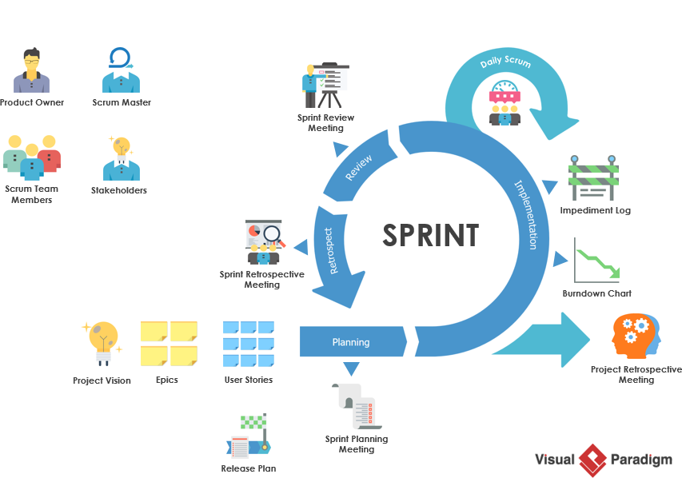
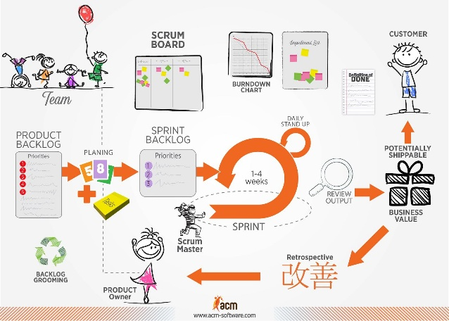

# Scrum

what i learned recently

---

https://www.scrum-tips.com/2016/02/17/stacey-complexity-model/

<!--
    Types of Projects

    Stacey's Complexity Model
    Cynefin Framework

    1. Simple
        - Known knowns
        - Rules / Best Practices
        - Sense (establish facts) - Categorize - Respond
    2. Complicated
        - Known Unknowns
        - Good Practices
        - Sense (asses facts) - Analyse - Respond
        - Structured Projects
    3. Complex
        - Unknown unknowns
        - Emergent
        - Probe (experiment new ideas) - Sense (observe outcomes) - Respond
        - Agile Projects
        - Empirical Process Control
    4. Chaotic
        - Act-Sense-Respond
    5. Disorder / Confusion
        - Break the big situation into smaller situations that fit to one of the above types.
-->
---

### Empirical Process Control
* Transparency
* Inspection
* Adaption

---
# Agile

<!--
    a mindset (attidudes / a way of working)
    defined by values (beliefs & norms)
    guided by principles
    manifested through practices
-->

---

https://www.compact.nl/articles/accelerating-agile-change-as-enabler-for-digital-transformation/

<!--
    Agile focuses on value optimization while managing the cost, time and scope

    iterative and incremental development

    Time-boxing

-->

---

Manifesto for Agile Software Development
2001

1. Kent Beck
1. Mike Beedle
1. Arie van Bennekum
1. Alistair Cockburn
1. Ward Cunningham
1. Martin Fowler
1. James Grenning
1. Jim Highsmith
1. Andrew Hunt
1. Ron Jeffries
1. Jon Kern
1. Brian Marick
1. Robert C. Martin
1. Steve Mellor
1. Ken Schwaber
1. Jeff Sutherland
1. Dave Thomas

---

### 4 Values

We are uncovering better ways of developing software by doing it and helping others do it. Through this work we have come to value:

* Individuals & interactions
* over
* processes & tools
* Working software
* over
* comprehensive documentation
* Customer collaboration
* over
* contract negotiation
* Responding to change
* over
* following a plan

That is, while there is value in the items on the right, we value the items on the left more.

---

### 12 Principles

1. Our highest priority is to satisfy the customer through early and continuous delivery of valuable software.
1. Welcome changing requirements, even late in development. Agile processes harness change for the customer’s competitive advantage.
1. Deliver working software frequently, from a couple of weeks to a couple of months, with a preference to the shorter timescale.
1. Business people and developers must work together daily throughout the project.
1. Build projects around motivated individuals. Give them the environment and support they need, and trust them to get the job done.
1. The most efficient and effective method of conveying information to and within a development team is face-to-face conversation.
1. Working software is the primary measure of progress.
1. Agile processes promote sustainable development. The sponsors, developers, and users should be able to maintain a constant pace indefinitely.
1. Continuous attention to technical excellence and good design enhances agility.
1. Simplicity–the art of maximizing the amount of work not done–is essential.
1. The best architectures, requirements, and designs emerge from self-organizing teams.
1. At regular intervals, the team reflects on how to become more effective, then tunes and adjusts its behavior accordingly.

<!--
     9. CI/CD, Unit Testing, Automated UAT
    10. MVP
    11. Reflect & Adjust - Scrum will tell you when & what

    If an agile project is in trouble - one or more of these principles are violated. Figure-out which ones are being violated and the solution will emerge.
--->

---

# Scrum

<!--
    a light-weight framework
    for process excellence & high performance (via collaboration)
    tells you what and when to do (not how)
    focus on incremental development via progressive elaboration
    simple to understand - difficult to master
-->

---

### Scrum Values

1. Commitment
   commit personally to achieve the team goal
1. Courage
   have courage to do the right thing and work on tough problems
1. Focus
   focus on sprint work and team goal
1. Openness
   open about all work and challanges faced
1. Respect
   respect eachother to be capable & independent

---

1. 3 Roles
1. Ceremonies (Events)
1. Artifacts

---

### Scrum Team
* is ...
    * cross-functional
    * self-organizing

<!---
    self-organizing
        no central management
        manages its own effort
    cross-functional
        has all the expetise and competencies needed to get the job done without help from outside the team.
    
    These two characteristics optimize 
        - flexibility
        - creativity
        - productivity
        that is needed in an agile environment
--->

---

## Roles
 

* Scrum Team
    1. Scrum Master
    1. Product Owner
    1. Development Team

* Stakeholders
    * Sponsors
    * Management
    * ...

https://medium.com/@SoyakaAI/003-involved-vs-committed-24ef51f32cce

<!---
    A pig and a chicken are walking down a road. The chicken looks at the pig and says, “Hey why don’t we open a restaurant?” The pig looks back at the chicken and says, “Good idea, what do you want to call it? The chicken thinks about it and says, “Why don’t we call it ‘Ham and Eggs’?” “I don’t think so,” says the pig, “I’d be committed but you’d only be involved.

    Question: In a bacon-and-egg breakfast, what's the difference between the Chicken and the Pig?
    Answer: The Chicken is involved, but the Pig commits!

    "Chickens" cannot tell the "pigs" how to do their work.

    pigs - internal to the project
    chickens - external to the project

    Scrum Master - manages the process
    Product Owner - manages the product
    Who manages the team ?

    Self-organizing team

    Scrum Master
        - A management position
        - Manage the process
        - Coach the team on Scrum / Agile
        - Servent leader
        - Conduct scrum ceremonies
        - Build the Scrum artifacts
        - Address team dynamics
        - Remove impediments
            - Technical
            - External distractions

    Product Owner
        - Manages the product
        - Customer's voice
        - Single point of respinsibility - Single, wringable neck (epitaph)
        - Translate the clients requirements to workable items
        - Manages the product backlog
            - Progressive elaboration
            - Prioritize / update / discard backlog items
        - Plan / initiate / close sprints
        - Specify the acceptance criteria
        - Accept / reject development work (based on acceptance criteria)
        - Report project progress to the stakeholders

    Who manages the team?

    Development Team
        Team size : 6 ± 3
-->

---

## Events

https://startinfinity.com/product-management-framework/scrum-sprint

<!--
    - Sprint Goal & Timebox cannot change
    - Sprint ends when the timebox expires
    - Product owner can cancel a sprint
    - Max sprint time-box: 4 weeks
    - No break between sprints

    Sprint Planning
        - Duration: 2hrs per 1 week of sprint work
        - Inputs:
            - Product Backlog
            - Capacity / Velocity
            - Current Project Status
            - Constraints
        - Discuss:
            - What - pick user stories
            - How - task breakdown
            - Definition of Done
            - Acceptance Criteria
            - Extimation for work items
        - Outputs:
            - Sprint Goal
            - Sprint Backlog
        
        - Participants:
            - Product Owner
            - Development Team
            - Scrum Master
    

    Daily Scrum
        - Time-box : 15 minutes
        - Participants:
            - Development Team (mandatory)

        - Each member mentions:
            - What was done since last meeting
            - Plan until the next meeting
            - Obstacles

    Sprint Review
        - Time-box : 1hr per 1 week sprint work
        - About the Product
        - For the Stakeholders & the team
        - Participants:
            - Development Team
            - Product Owner

        - Showcase the working product
        - Present the project progress
        - Verify increment against "DoD" and Acceptance Criteria

        - Discuss:
            - what is done what is not
            - sprint
            - increment
            - current business conditions

        Update product backlog

    Sprint Retrospect
        - Time-box : 1hr per 1 week sprint work
        - About the Process
        - Participants:
            - Development Team
            - Scrum Master
            
        Discuss:
            - What went well during the sprint?
            - What could be improved?
            - What will we commit to doing in the next sprint? 
            (team makes actionable commitments)

        Atlasian playbook: https://www.atlassian.com/team-playbook/plays/retrospective

    Backlog Grooming
        - Not time-boxed
        - As and when the team requests
        - Not exceeding 10% of team's time
        - Progressive elaboration
        - Participants:
            - Product Owner
            - Development Team

        - Prioritize
        - Split
        - Discard
        - Add

        - Defintion of Ready
        - Acceptance Criteria

        Vision -> Roadmap Planning -> Release Planning -> Sprint Planning

-->

---

## Artifacts

- Product Backlog
- Sprint Backlog
- Burn-Down Chart
- Product Increment

<!--
    Aditional Artifacts
        - Product backlog delta report
        - Impediment list
        - Product burn-down
-->

---

https://www.visual-paradigm.com/scrum/what-are-scrum-ceremonies/

---

https://www.slideshare.net/ACMSoftware/scrum-framework-58695170

---

# Tips

---

### User Stories

* Indepedent
* Negotiable
* Valuable
* Estimable
* Small
* Testable