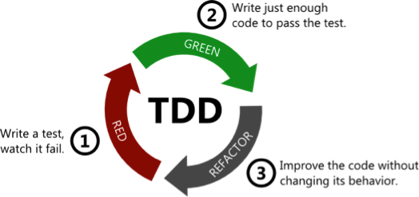
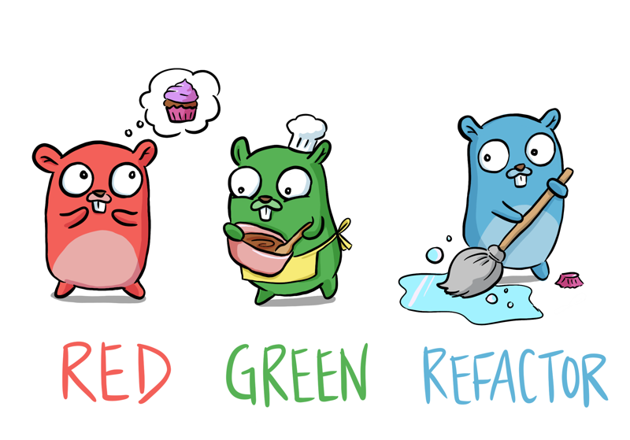

# TDD
 Why TDD is Important

  
- Eranga Jayalatharachchi
<!--

-->

---

## About Me
- I Code
- I Read
- I Tinker
---

## TDD?
https://www.sli.do/
39454

---

---

---
## Disparity
       

---

## Reliability

---

## Testing

---

## Cost

---

---

| parts          | functions    | unit testing            |
|----------------|--------------|-------------------------|
| **components** | **modules**  | **integration testing** |
| **car**        | **software** | **end-to-end testing**  |

---

Image credit: [martinfowler.com](https://martinfowler.com/articles/practical-test-pyramid.html)

---

   
Imge credit: [Mulesoft Blog](https://blogs.mulesoft.com/dev-guides/refactoring-munit-the-mule-testing-framework/)

---

## improve
---

| Software Engineers           |
|------------------------------|
| skilled                      |
| write code                   |
| build software               |
| address business requirement |
| deliver functionality        |
---

| Automation Engineers               |
|------------------------------------|
| skilled                            |
| write code                         |
| test software                      |
| verify fit to business requirement |
| deliver reliability                |
---

| Software Engineers               | Automation Engineers               |
|----------------------------------|------------------------------------|
| skilled                          | skilled                            |
| write code                       | write code                         |
| build software                   | test software                      |
| **address** business requirement | **verify fit to** business requirement |
| deliver **functionality**        | deliver **reliability**                |
---

## engineer's workflow
1. code
2. automated test 

---

## executable specifications

---

## engineer's workflow
1. specification
2. code
---
## Evolution

1. No Test Development
2. Test-Last Development (TLD)
3. Test-First Development (TFD)
4. Test-Drivern Development (TDD)
---

## TFD

1. Write a test
2. Write production code until all tests are passing
---

## TDD

1. Write a test
2. Write production code until all tests are passing
3. Refactor until happy with code structure
---

  
Image credit [Techwell.com](https://www.techwell.com/techwell-insights/2018/12/keep-your-code-base-clean-regular-refactoring)

---

Image credit [Densie Yu / Learn Go with Tests](https://quii.gitbook.io/learn-go-with-tests/)

---

# The 3 Rules of TDD
_Robert C Martin (Uncle Bob)_

1. You are not allowed to write any production code unless it is to make a failing unit test pass.
1. You are not allowed to write any more of a unit test than is sufficient to fail; and compilation failures are failures.
1. You are not allowed to write any more production code than is sufficient to pass the one failing unit test.

---

| Scientific Method | TDD                 |
|-------------------|---------------------|
| Question          | Requirement         |
| Prediction        | Expected Output     |
| Experiment        | Test Assertion      |
| Subject           | Implementation Code |

 

Credit : [Eric Elliott](https://medium.com/javascript-scene/testing-software-what-is-tdd-459b2145405c)

---

## Advantages of practicing TDD
- Incremental & iterative Development
- Change / refactoring with confidence
- Emergent design
- Forces developers to think
- Helps to clarify requirements
- Faster / smaller feedback loop
- Documents your code better

---
## Advantages of practicing TDD
- Safety-net
- Better code coverage
- Faster developer feedback loop
- Interface design aid 
- KISS : Keep it Simple, Stupid
- YAGNI : You Ain’t Gonna Need It

---

## Concerns
https://www.sli.do/
39454

---
## Concerns

1. Slow down the development
2. Job loss
3. Expensive
4. Waste of time / effort
5. A lot more work
6. Locks design
---
## Why not practice
https://www.sli.do/
39454

---

## Why not practice

1. Concerns about TDD
2. Does not solve our problems
3. Management does not give us time
4. I am a great programmer - I don’t need TDD
5. Tests should be written by others - possibly QA
6. The code is not testable

---
## Why not practice

7. Everything is not testable
8. I will write tests at the end
9. This is a POC - no need to write tests
10. They take a lot of time to run
11. My clients don’t care

---
## Why not practice
12. Do not know how

---

## Wrong Reasons

1. Resume Driven Development
2. Silver-bullet for technical debt
3. No analysis / design needed
4. My company needs me to

---

## The Problem
##### with the wrong reasons

---

Image Credit : [NHS](https://www.hey.nhs.uk/patient-leaflet/hand-hygiene-information/)

---

3. Right value
2)  Consistency
1. Why
0) Emotion

---

# Right Reasons
- Professionalism
- Ethics

---

#  When not to do TDD
1. Experimenting
2. One-off things
3. External scope / products
4. Does not understand the existing product

---

# Tread Carefully
- Don't get distracted by frameworks
- Don't go to extremes with unit tests
- Maintains the tests
- Doing it vs doing it well
- Not just unit tests
- Time investment

---

# Tread Carefully
- GUI code
- Maintaining tests can be difficult
- Mocking hell
- Speeds vs frequencies
- Baby steps
- Quality vs Tests

---
# Common mistakes

1. Do not watch the test fail
2. Forget the refactoring step
3. Refactor other code while writing a test
4. Use bad test names
5. Do not start from the simplest test
6. Run only the current failing test
7. The need for writing a complex test scenario
8. Do not refactor the test code
9. Do not implement the simplest thing

---
# Questions?

