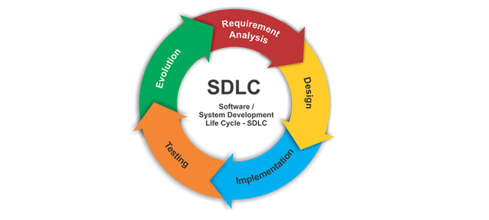
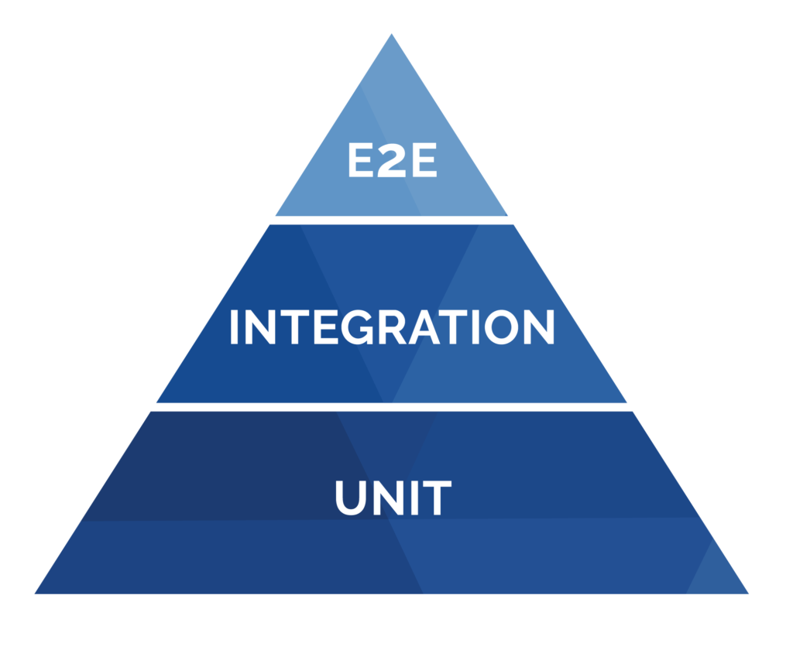

# TDD

test-driven _developement_

<!--
    Synopsis:
    
    Why is it so hard to test software?
    Why do we always find bugs in software sooner or later?
    How can I work more effectively so that my code is bug free?
    How can I work more efficiently so that I can push out features faster?

    We are going to discuss about Test-Driven-Development, a technique that can be used to address all the above concerns. Once you understand the fundamentals, we will get our hands dirty by practicing the technique ourselves. 
-->

---

### The 12 Agile Principles

1. Our highest priority is to satisfy the customer through early and continuous delivery of valuable software.
1. Welcome changing requirements, even late in development. Agile processes harness change for the customer’s competitive advantage.
1. Deliver working software frequently, from a couple of weeks to a couple of months, with a preference to the shorter timescale.
1. Business people and developers must work together daily throughout the project.
1. Build projects around motivated individuals. Give them the environment and support they need, and trust them to get the job done.
1. The most efficient and effective method of conveying information to and within a development team is face-to-face conversation.
1. Working software is the primary measure of progress.
1. Agile processes promote sustainable development. The sponsors, developers, and users should be able to maintain a constant pace indefinitely.
1. Continuous attention to technical excellence and good design enhances agility.
1. Simplicity–the art of maximizing the amount of work not done–is essential.
1. The best architectures, requirements, and designs emerge from self-organizing teams.
1. At regular intervals, the team reflects on how to become more effective, then tunes and adjusts its behavior accordingly.

---
# How to ensure the code is working?
<!--
    Test
    prove - it is doing what we intended
-->

---

<!--
    software development - broken into phases
    is phased aproach sufficient?

    I have been programming for long. I can write working code without the need for tests.

    Programmers & pride => arrogance
-->

---
Optimism is an occupational hazard of programming; feedback is the treatment.
— Kent Beck

---

---

# What is TDD?

<!--
    development of the code - driven by tests
-->

---

# Why is it important?

<!--
    a shift in the way we think about what we are doing.

    A typical coding session:
        - writing the code the cleverest way we can to get the work done.
        - the focus is on the algorithms, techniques and tools

    With TDD:
        - the focus - what needs to be done - a specification of the behaviour
        - how to do it

    without TDD
        focus - the right way
    with TDD
        focus - the right thing

    With TDD, how to achieve the right way?
-->

---

<!--
    How do we implement the feedback loop?

    1. write / modify the code.
    1. run it against the specification with some known inputs
    1. compare the output with the expected behaviour

    We can't wait until the end to get the feedback.
    We need
        - as fast as possible
        - as many times as we need

    Depending on humans to give the feedback is
        - slow
        - inconvenient
        - expensive
--->

---
# Automated Testing

<!--
    Automate tests
        - small upfront cost
        - cost of testing is very low
        - Low cost ==> run often
        - fast
-->

---

<!-- 
    Different levels of tests

    - test a feature
    - test collaboration of multiple features to achive a behaviour
    - test a full workflow

    As we go up in the pyramid:
        - tests get complicated
        - running cost increases
        - running time increases
-->

---
## How fast should it run?

120 x 10

<!--
    Calculation :
        120 units
        10 TCs

        - 1 second per test = 1200 seconds = 20 min
            wait 20 min to know - code change good / bad

        - 10 ms per test = 120 sec = 2 min

-->

---

### It worked

<!--
    If it runs fast ==> can execute more often 
    
    without impeding our development speed.

    If we run tests every 2 minutes, we know that everything we worked on upto the last 2 minutes worked.

    If the last change is not good, how much debugging do we need?
-->

---
# How to write test effectively ?

<!--
    Change of mindset.

    Don't write tests - write specifications for the code behaviour
    e.g.- RSpec, Fitnesse, Jasmine
-->

---

## Professions *have* Practices  

##### Healthcare is a _Profession_
##### Accounting is a _Profession_

<!--
    Is programming a profession?

    Why Healthcare / Accounting?
        - a high risk profession.

    Practices:
        - A doctor washing hands before a surgery.
        - Double entry book keeping.

-->

---

# The 3 Rules of TDD

_Robert C Martin (Uncle Bob)_

1. You are not allowed to write any production code unless it is to make a failing unit test pass.
1. You are not allowed to write any more of a unit test than is sufficient to fail; and compilation failures are failures.
1. You are not allowed to write any more production code than is sufficient to pass the one failing unit test.

---
# The TDD Practice
<!--
    TDD Cycle

    1. Write a failing test
    2. Make it pass
    3. Make it right
-->

---

# Red

1. Write a failing test

<!--
    - Write a test for the next bit of functionality you want to add
    - Run the tests to ensure the new test is failing
-->

---

# Green

2. Make it pass

<!--
    - Write the simplest production code which will satisfy the test
    - Make all tests pass
    
    - Write the functional code until the test passes
-->

---

# Refactor

3. Make it right

<!--
    - Refactor both new and old code to make it well structured

    - Eliminate duplication - "Eliminate duplication” is something more than typical Refactoring. It is more about decoupling the tests and production code by removing duplication between them.
    - Clean-up code
    - Re-run all tests to verify

    - neglecting Refactoring phase is the most common cause of bad design and screws up all TDD process -  Martin Fowler.
-->

---

### an example

<!--
    Fizz-Buzz
-->

---
# Why don't we practice it ?
## The Lies

<!--
    - It increased the development time
    - It is more work
    - It increases the maintenance cost
    - My code is very straight-forward, so it is not needed.
-->

---
# Why don't we practice it ?
## The Truth

<!--
    - I do not know how
    - Management doesn't recognize the value
    - Slowed-down by a hostile codebase
-->

---
# Why should we ?
## The HARD Truth

<!--
    - Excuses are lies that you tell youself
    - The professional obligation
-->

---
# Kata

<!--
    Kata = Form 
    A sequences of movements that are put together in an overall pattern.

    Practice on the job = practice at the fight

    http://codingdojo.org/?KataCatalogue
    https://katas.softwarecraftsmanship.org/
-->

---
## ... _on to the Dojo_
<!--
    Hands-on time
        - Prime Numbers
        - Roman Numerals
-->

<!--

Advanced Topics

Broken Test is for solo programming:
    How do you leave a programming session when you’re programming alone? Leave the last test broken… When you come back to the code, you then have an obvious place to start. (p.149)

Clean Check-in is for team programming:
    How do you lave a programming session when you’re programming in a team? Leave all of the tests running.

Three techniques for quickly getting to green
    Fake It
    Obvious Implementation
    Triangulation

State-ful vs state-less implemtnations

Test Doubles
    Dummy
    Stub
    Spy
    Mock
    Fake

-->