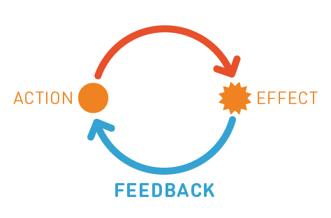

# TDD

test-driven _developement_

---

### The 12 Agile Principles

1. Our highest priority is to satisfy the customer through early and continuous delivery of valuable software.
1. Welcome changing requirements, even late in development. Agile processes harness change for the customer’s competitive advantage.
1. Deliver working software frequently, from a couple of weeks to a couple of months, with a preference to the shorter timescale.
1. Business people and developers must work together daily throughout the project.
1. Build projects around motivated individuals. Give them the environment and support they need, and trust them to get the job done.
1. The most efficient and effective method of conveying information to and within a development team is face-to-face conversation.
1. Working software is the primary measure of progress.
1. Agile processes promote sustainable development. The sponsors, developers, and users should be able to maintain a constant pace indefinitely.
1. Continuous attention to technical excellence and good design enhances agility.
1. Simplicity–the art of maximizing the amount of work not done–is essential.
1. The best architectures, requirements, and designs emerge from self-organizing teams.
1. At regular intervals, the team reflects on how to become more effective, then tunes and adjusts its behavior accordingly.

---

---

---

### It worked

---
# Automated Testing

---

<!-- 
    Mars rover - 7 minutes latency in communication (in one direction)
-->

---
## How fast should it run?

<!--
    Calculation :
        3000 classes
        10 TCs

        - 1 second per test
        - 100 ms per test

-->

---

## Professionals *have* Practices  

##### Accounting is a _Profession_

<!--
    Why Accounting?
    - a high risky job.

    Practices:
        - A doctor washing hands before a surgery.
        - Double entry book keeping.    
-->

---
# The TDD Practice
<!--
    1. Write a (failing) test
    2. Make it pass
    3. Clean-up code
-->

---

# Red

---

# Green

---

# Refactor

---
# Kata

<!--
Kata = Form 
A sequences of movements that are put together in an overall pattern.

Practice on the job = practice at the fight

http://codingdojo.org/?KataCatalogue
https://katas.softwarecraftsmanship.org/

-->

---
# Legacy Code

<!--
Legacy:
Code without tests
-->

---

## Boy Scout Rule

> Leave things better than you found them.
- Robert Baden Powell